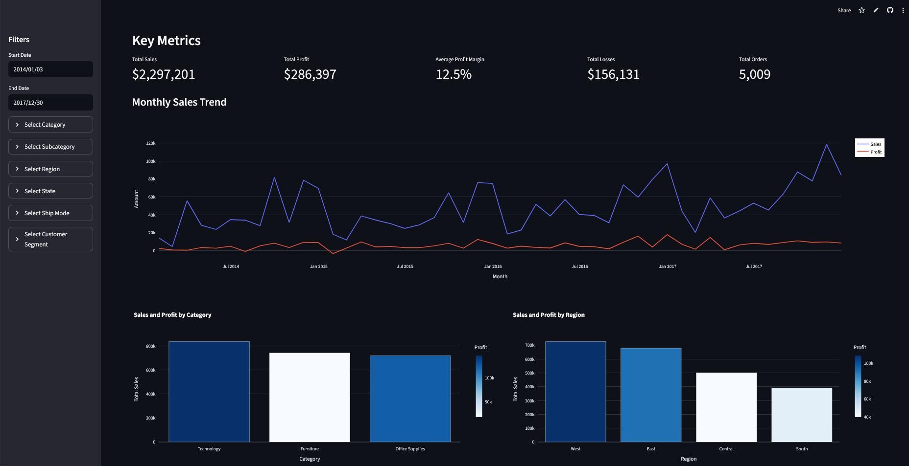

# Interactive Superstore Dashboard

This project creates an interactive dashboard using the Superstore dataset with Streamlit.

**[Live Demo](https://superstore-app-dashboards.streamlit.app/)** 



## Features

- Interactive filters by date range, category, and region
- Multiple visualizations including time series, bar charts, and treemaps
- Key performance metrics
- Tabbed interface for organized data exploration
- Raw data view with download option

## Installation

1. Clone this repository
2. Install requirements:
```
pip install -r requirements.txt
```

## Usage

Run the Streamlit app:
```
streamlit run dashboard.py
```

The dashboard will open in your default web browser at http://localhost:8501.

## Data

The dashboard uses the "Sample - Superstore.csv" dataset, which contains sales data including:
- Order and shipping information
- Customer details
- Product categories
- Sales and profit metrics

## Dashboard Structure

1. **Overview Tab**
   - Key metrics (Total Sales, Total Profit, Profit Margin, Total Orders)
   - Monthly sales trend
   - Sales and profit by category and region

2. **Sales Analysis Tab**
   - Sales by sub-category
   - Sales distribution by shipping mode and customer segment
   - Top 10 customers by sales

3. **Profit Analysis Tab**
   - Profit by category and sub-category (treemap)
   - Profit vs. sales scatter plot
   - Discount impact on profit 